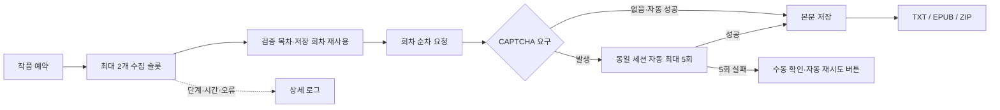

<p align="center"></p>

<p align="center">
  <a href="docs/INSTALL.md"></a>
  
  
  <a href="LICENSE"></a>
</p>

<p align="center"><a href="docs/INSTALL.md"><b>설치 매뉴얼</b></a> · <a href="docs/DASHBOARD.md">대시보드 사용법</a> · <a href="docs/UPDATE.md">업데이트</a> · <a href="docs/TROUBLESHOOTING.md">문제 해결</a> · <a href="https://github.com/organic4597/Novel-collector/wiki">Wiki</a></p>

# Novel Collector

앱 버전 **1.0.0.8**. 수집 중인 예약도 현재 회차 저장 후 순서를 변경하며, 제목형 대체 표지와 작가 검색을 제공합니다. 업데이트 대기 전 모듈 선로딩 오류를 수정했습니다. 설치·업데이트 사전 권한 검사, 실제 태그 중복 제거·원본 평점, 관리자 복구·기본 프리셋·실시간 업데이트 로그와 12시간 브라우저 연결 갱신도 포함합니다.

Node.js·Playwright 기반 소설 수집기와 웹 대시보드입니다. 최대 두 작업을 실행하고 작품별 회차는 순서대로 처리합니다. 데이터는 로컬 파일 저장소에 보관합니다.

## 주요 기능

- [공식 최신 ZIP 다운로드](https://github.com/organic4597/Novel-collector/releases/latest)와 [초기 로그인·관리자 복구 안내](docs/INSTALL.md#관리자-비밀번호를-잊었을-때)
- 직접 로컬 주소의 비밀번호 복구: 변경 범위 확인, 확인 문구, 새 접속 정보 파일 저장, 기존 관리자 세션 무효화
- 기본 추출 프리셋 선택·추가: 기존 설정을 보존하는 수정 가능한 독립 복사본
- 만료 목록 캐시 우선 표시·백그라운드 갱신, 탭 복귀 시 목록 유지, 카드·썸네일 유지와 부분 갱신
- 작업 로그 선택 즉시 조회, 이전 작업의 늦은 응답 차단과 로그 행·스크롤 유지

- 작품 등록, 예약·일시정지·재개, 실패 회차 재수집
- 예약 목록 삭제(저장 본문 유지), 미업로드 회차 실패 기록 후 다음 회차 진행
- 파일 기반 작품·회차 저장, TXT/EPUB 및 묶음 다운로드
- 작품 카드 클릭으로 작가·태그·줄거리·연재 상태를 확인하는 소개 팝업
- 작품 찾기 페이지당 40개 카드 자리 선배치, 준비된 작품부터 순차 표시와 첫 작품 위치로 스크롤
- 12시간 브라우저 연결 갱신, 사용 중인 연결은 회차 저장·수동 인증 완료 뒤 안전한 시점에 재연결
- 같은 브라우저 세션을 유지하는 사이트 인증과 사용자 CAPTCHA 창
- 서버의 `captcha_required_daily_quota` 응답에만 실행되는 조건부 CAPTCHA 모듈
- 세션별 단일 CAPTCHA 처리, OpenCV 후보 분석, 1.8~4.5초의 실제 브라우저 드래그 기록 검증
- 새 챌린지로 최대 **5회 자동 시도**, 모두 실패하면 기존 수동 CAPTCHA 방식으로 전환
- 자동 시도 중 수동 화면 차단, 대시보드 자동 재시도 버튼과 단계별 진행 표시
- 상세 로그 페이지, 시도별 예상 시간 갱신, 검증 목차 재사용과 변경 카드만 렌더링
- [추출 프리셋](docs/PRESETS.md): 한 프리셋의 세 페이지 유형·항목별 이미지 안내, 영역 저장·재강조, 선택 항목 미리보기와 서버 저장
- 하루 한 번 GitHub 정식 릴리스 확인, 새 버전 알림과 사용자 클릭 업데이트
- 코드/런타임 사전 준비·개인정보 로컬 백업·실패 복구, Windows/Linux 설치 스크립트

CAPTCHA 자동 제출은 평가된 이미지 점수·후보 차이 임계값을 설정한 경우에만 활성화됩니다. 기본값은 분석 후 제출 보류입니다. 자세한 규약은 [CAPTCHA 문서](docs/CAPTCHA.md)를 확인하세요.

## 실행 환경

Windows와 Linux에서 같은 **`run.mjs`** 실행기를 사용합니다. 런타임이 없는 환경은 소스 ZIP 해제 후 Windows `install.ps1`, Linux `bash install.sh`로 Node.js·Python·npm·OpenCV·Chromium을 준비합니다. 설치 후 `start.ps1` / `bash start.sh`로 실행합니다.

```sh
node run.mjs
```

기본 대시보드는 `http://127.0.0.1:8788`입니다. `HOST`, `PORT`, `BROWSER_PATH`, `PROFILE_DIR`로 실행 환경을 지정할 수 있습니다. `deploy/novel-collector.service`는 설치 경로와 전용 사용자를 준비한 뒤 조정할 수 있는 일반 템플릿입니다.

첫 실행은 빠진 npm 런타임 패키지·독립 Python/OpenCV 환경·Chromium을 준비합니다. 이후에는 확인 후 바로 실행하며 기존 DB·계정·브라우저 프로필을 재사용합니다. 경로에 공백이 있어도 실행할 수 있습니다. `npm start`도 같은 실행기를 호출합니다.

```sh
node run.mjs --setup      # 준비만 수행
node run.mjs --check      # 설치 없이 실행 환경 확인
node run.mjs --no-setup   # 준비된 환경으로 서버 실행 (서비스용)
```

서비스 설치·관리자 첫 접속·브라우저 의존성·CAPTCHA 환경 설정까지는 [단계별 설치 가이드](docs/INSTALL.md)를 사용하세요.

## 한눈에 보는 흐름



첫 실행에서 관리자 인증 파일이 로컬 `secrets/`에 만들어집니다. 사이트 계정은 설정 화면에서 등록하며 암호화해 저장합니다. 실행 데이터·자격정보·브라우저 프로필은 Git 추적 대상이 아닙니다.

## 구조

| 경로 | 역할 |
|---|---|
| `run.mjs` | Windows/Linux 공통 준비·점검·실행 진입점 |
| `src/` | HTTP 서버, 스케줄러, 수집기, 저장소, 사이트 인증 |
| `public/` | 대시보드 화면 |
| `tests/` | 단위·통합 테스트와 합성 fixture |
| `tools/` | 이미지 분석·평가 및 Git 공개 대상 검사 |
| `docs/` | 공개용 기능 계약과 검증 문서 |
| `data/`, `profile/`, `secrets/` | 실행 중 생성되는 로컬 전용 데이터 |

## 검증

```sh
npm test
npm run test:captcha
npm run test:captcha:images
node tools/check-publication.mjs
```

1.0.0.4 변경 회귀 **670개 통과**와 커버리지·운영체제 검증 범위는 [검증 현황](docs/TESTING.md), 수명·소유권 경계는 [기능 계약](docs/CONTRACT.md)에 기록했습니다. 자동 CAPTCHA 두 테스트 파일은 이번 변경 검증에서 제외했습니다.

## 저장소 포함 범위

소스, 합성 테스트, 의존성 명세, 일반 배포 템플릿과 공개 문서만 포함합니다. 수집 본문·DB·비밀번호·계정·쿠키·토큰·브라우저 프로필·실사이트 HTML 캡처·운영 서버 주소·이전 배포 압축본은 포함하지 않습니다. `.gitignore`는 검토한 파일 유형만 허용하는 방식입니다.

## 문서 지도

| 문서 | 확인할 내용 |
|---|---|
| [설치](docs/INSTALL.md) | 준비물, 첫 실행, systemd, 환경값 |
| [대시보드](docs/DASHBOARD.md) | 예약·보관함·자동 CAPTCHA·상세 로그 |
| [추출 프리셋](docs/PRESETS.md) | 설치 없는 북마크릿 선택·미리보기·JSON 가져오기 |
| [업데이트](docs/UPDATE.md) | 자료를 보존하는 소스 갱신·복구 |
| [문제 해결](docs/TROUBLESHOOTING.md) | 목차 시간 초과, 인증, 브라우저, 화면 지연 |
| [CAPTCHA](docs/CAPTCHA.md) | 상태·좌표·trail·재시도 규약 |
| [계약](docs/CONTRACT.md) / [검증](docs/TESTING.md) | 수명·소유권과 실제 테스트 범위 |
