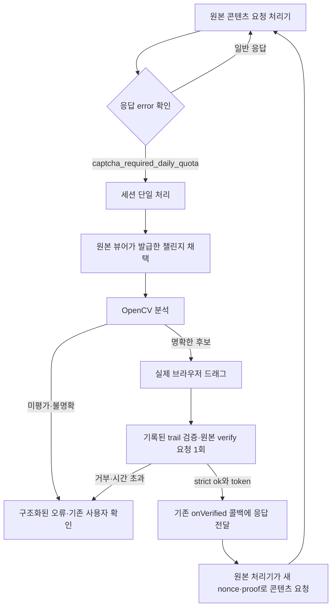

# 조건부 CAPTCHA 모듈

구현일: 2026-10-03. 실행 흐름과 모듈 간 계약을 설명합니다.

## 현재 적용 상태

`server.mjs` → `Collector`의 실제 회차 읽기 경로에 연결했습니다. 임계값 미설정 시 기본 상태는 **분석 후 제출 보류**입니다. `CAPTCHA_MIN_SCORE`와 `CAPTCHA_MIN_MARGIN`을 설정한 환경에서는 명확한 위치에 대해 챌린지당 한 번 드래그·검증을 수행합니다. 재시도 가능한 실패는 새 챌린지로 최대 **5회** 시도하고, 다섯 번째까지 실패하면 기존 `NEEDS_ATTENTION`과 서버 CAPTCHA 창으로 이어집니다. 성공하면 수동 대기 상태를 만들지 않고 수집을 재개합니다. 자동 예산이 남아 있거나 대시보드 자동 재시도가 실행 중이면 수동 화면을 표시하지 않습니다.

합성 이미지 정확도와 로컬 테스트 서버의 응답 검증은 실제 원본 서버의 통과율을 뜻하지 않습니다. 제공된 실제 패킷의 쿠키·챌린지 ID·토큰·궤적은 코드나 fixture에 저장하지 않았습니다.


## 책임과 연결

| 파일 | 역할 |
|---|---|
| `src/novel-captcha.mjs` | 실행 조건, 세션 단일 처리, 상태·기한, 챌린지/성공 응답 검증, 구조화된 결과 |
| `src/captcha-browser.mjs` | 같은 Context/Page의 응답 감시, 원본 발급 요청 채택, 실제 포인터 입력, 검증·토큰 전달 연결 |
| `src/captcha-trail.mjs` | 현재 챌린지에 대한 실제 trail의 좌표·시간 검증 |
| `src/captcha-analyzer.mjs` | 제한된 Python subprocess 실행·취소·오류 변환 |
| `tools/captcha_position.py` | OpenCV 이미지 검증, 후보·점수·좌표, 선택형 진단 PNG |
| `tools/evaluate_captcha.py` | 저장된 정답 표본의 위치 오차·제출 선택 비율 평가 |



일반 요청은 CAPTCHA 발급·이미지 분석·포인터 입력을 시작하지 않습니다. 응답 감지는 현재 회차의 `novelId`·`episodeId`, origin, 메인 frame, 문서 세대에 한정합니다. core는 응답을 관찰할 수 없는 환경의 `{source:"ui", responseObservable:false, visible:true}`도 지원합니다. 현재 Playwright 연결에서는 응답 관찰이 가능하므로 UI만 보고 실행하지 않습니다. Cloudflare 등 다른 종류의 확인 화면은 기존 사람 확인 경로를 사용합니다.

상태: `IDLE → CREATING → ANALYZING → VERIFYING → SUCCEEDED|FAILED`. 모든 종료 경로에서 coordinator의 진행 잠금을 해제합니다. 하나의 BrowserContext에는 안정된 내부 session 객체를 할당하며, 같은 진행 작업에 합류한 호출자는 각자의 `requestId`와 동일한 `sessionKey`로 결과를 받습니다. 풀은 슬롯당 하나의 Context/Page 소유권을 배타적으로 유지합니다.

core 결과:

```js
// 성공 (메모리 내부 전용)
{ ok: true, requestId, sessionKey, captchaToken, remaining }
// 실패
{ ok: false, requestId, sessionKey, error: { code, serverError? } }
// 실행 조건 아님
{ ok: false, skipped: true }
```

현재 앱에는 직접 HTTP 콘텐츠 요청 생성기가 없습니다. 원본 뷰어가 그 역할을 합니다. 따라서 성공 응답을 원본 verify 호출에 전달하여 기존 `onVerified(token)`이 콘텐츠 처리를 재개하도록 했습니다. 모듈은 콘텐츠 본문을 재전송하거나 `nonce`·`proof`를 만들지 않습니다. `remaining`은 서버 보고값으로만 보관하며 모듈이 토큰 재사용 횟수를 계산하지 않습니다. 토큰과 이미지의 임시 참조는 종료 시 해제합니다.

## 관찰한 클라이언트 규약

2026-10-03 공개된 뷰어의 아래 정적 자산을 읽어 확인했습니다.

`https://toki.peertrk.com/b1790626427687/_next/static/chunks/01z_llnxlv0u-.js?dpl=b1790626427687`

- 발급: `POST /api/novel-captcha/create`, **본문 없음**, `content-type: application/json`, `x-novel-client: shadow-v3`. 원본 뷰어의 발급 요청을 한 번 채택하므로 모듈과 UI가 따로 발급하지 않습니다. `{}` 본문은 거부합니다.
- 발급 데이터에 `piece` 이미지 사용이 확인됐습니다. `background`, `piece`, 크기, `y`, `challengeId`, 수신 시각을 한 객체로 결합합니다. PNG 실제 크기가 선언과 다르면 중단합니다.
- 원본의 수평 변환: `x = clamp(startX + (clientX-startClientX) * (width-pieceWidth) / max(1, trackWidth-44))`. `trackWidth`는 `max(160, track.getBoundingClientRect().width)`입니다.
- 최종 제출은 `x: Math.round(x)`, `y: challenge.y`입니다. `trail.x`는 위 변환 후 조각 좌표, `trail.y`는 화면 `clientY`, `trail.t`는 `performance.now() - startedAt`입니다.
- 이미지 후보는 peak 주변 포물선 보간 또는 평탄한 peak의 중심으로 서브픽셀 `targetX`를 계산합니다. 이동 거리·`trail.x`·`trail.t`는 부동소수점 값을 유지하며, 최종 제출 본문의 `x`에만 반올림합니다. 진단 PNG의 픽셀 표시용 반올림은 분석·제출 좌표를 수정하지 않습니다.
- 자동 입력은 이 식을 역산하여 실제 브라우저 pointer 이벤트를 보냅니다. 서버 제출용 trail 배열을 합성하거나 샘플 궤적을 재생하지 않습니다. 원본 클라이언트가 기록한 배열을 제출 직전에 검사합니다.
- 슬라이더 폭 44px, 시작 위치, 표시 중인 이미지가 현재 챌린지와 일치하는지 확인합니다. 원본 UI 규약이 바뀌면 `CLIENT_CONTRACT_CHANGED`로 중단합니다.
- 검증: 동일 세션의 원본 `POST /api/novel-captcha/verify`. 리다이렉트와 자동 네트워크 재시도는 0회입니다. 원본 쿠키 저장소와 실제 브라우저 요청 헤더를 사용하며 별도의 쿠키 문자열·지문 헤더를 구성하지 않습니다.

이는 클라이언트 소스 확인 결과입니다. 실제 사이트에서 정상 사람 드래그를 추가 관찰한 결과나 서버 내부 검사의 확인으로 확대 해석하지 않습니다.

### 시간 규칙 — 사용자 지정

- 허용 총 시간: **1,800~4,500ms**, 양 끝 포함.
- 기본 목표 시간: **2,400ms**.
- 실제 마지막 `trail.t`로 판정합니다. 첫 `t`는 0, 이후 시간은 단조 비감소여야 합니다.
- 범위를 벗어나면 `TRAIL_DURATION_OUT_OF_RANGE`, 순서·좌표·챌린지 연결이 잘못되면 `TRAIL_INVALID`로 제출 전에 중단합니다.
- 제공된 과거 패킷의 약 1,342ms 궤적은 새 시간 정책의 허용 범위에 들지 않습니다.
- 이 범위는 앱 정책이며 서버의 최소 시간 기준이 확인됐다는 뜻은 아닙니다.

## 이미지 분석·평가

분석은 원본 크기에서 수행하므로 리사이즈 환산 오차가 없습니다. `y`의 가로 strip을 대상으로 alpha mask를 적용한 OpenCV 정규화 상관 점수로 후보를 구하고, 가까운 동일 peak를 억제한 뒤 다음 독립 후보와의 차이를 계산합니다. 빈칸이 단색으로 덮여 원래 질감이 남아 있지 않을 때는 조각의 alpha 외곽과 배경 edge를 비교합니다. 이때 점수는 외곽 픽셀 중 배경 edge의 2픽셀 이내에 있는 비율입니다. 두 방식이 모두 제출 기준을 만족하면서 좌표가 2픽셀 넘게 다르면 보류합니다. `piece`가 없거나 유효한 질감·alpha 외곽이 없으면 윤곽 후보를 진단용으로만 추출합니다. `tolerance:8`을 임의 좌표 허용치로 사용하지 않습니다.

임계값을 설정하지 않으면 `reason: UNCALIBRATED`, `decision: abstain`을 반환합니다. `matchScore`는 성공 확률이 아닙니다. 불명확한 후보, 크기 불일치, 파손 이미지도 제출되지 않습니다.

의존성 준비:

```sh
uv venv --python /usr/bin/python3 .venv-captcha
uv pip install --python .venv-captcha/bin/python -r requirements-captcha.txt
```

Python 3.9 환경에서 OpenCV 4.12.0.88 / NumPy 2.0.2를 고정했습니다. 기본 Python 경로는 프로젝트의 `.venv-captcha/bin/python`이며 `CAPTCHA_PYTHON`으로 변경할 수 있습니다.

단일 이미지 입력 JSON은 `{ "challenge": { ... }, "profile": { "minScore": ..., "minMargin": ... } }`입니다. profile을 생략하면 분석만 합니다.

```sh
.venv-captcha/bin/python tools/captcha_position.py --diagnostic /tmp/captcha-diagnostic.png < /path/to/challenge-input.json
```

평가 데이터는 `[{ "challenge": { ... }, "expectedX": 117 }, ...]` 배열입니다. 쿠키·토큰·proof는 넣지 않습니다. 아래 값은 **합성 fixture용 예시**이며 운영 권장값이 아닙니다.

```sh
.venv-captcha/bin/python tools/evaluate_captcha.py /path/to/labeled-challenges.json --min-score 0.85 --min-margin 0.12 --diagnostics /tmp/captcha-diagnostics
```

보고서는 `coverage`, `acceptedPositionAccuracy`, `meanAbsoluteError`를 산출합니다. 서버 요청을 하지 않으므로 `serverVerificationSuccessRate`는 `null`입니다. 실제 제출 성공률은 허가된 환경의 검증 응답으로 따로 측정해야 합니다.

평가 후 선택한 `CAPTCHA_MIN_SCORE`와 `CAPTCHA_MIN_MARGIN`(각각 0 초과 1 이하)을 서비스 환경에 설정하고 재시작하면 자동 제출 경로가 활성화됩니다. 현재는 운영 이미지 평가와 해당 환경값 설정이 남아 있습니다.

## 실패·취소·기록

한 번의 중단 회차 처리에서 자동 시도는 **최대 5회**입니다. 각 시도는 새 챌린지를 발급받고 해당 챌린지는 최대 한 번 검증합니다. 원본 UI의 독립적인 자동 발급은 실패 잠금으로 막고, Collector가 이전 포인터·HTTP 작업을 정리한 뒤 **현재 회차**만 다시 요청합니다. 목차를 재스캔하지 않습니다. 원본 처리기가 새로운 nonce/proof를 만들며 같은 verify 요청은 재전송하지 않습니다. 다섯 번째 실패만 작업의 `NEEDS_ATTENTION`으로 전달하여 기존 수동 창을 사용하게 합니다. 성공은 중간 실패를 작업 실패로 기록하지 않습니다.

대시보드의 `POST /api/captcha-session/retry {}`는 새 5회 예산을 시작하고 `202`로 안전한 진행 상태를 반환합니다. `GET /api/captcha-session/status`에서 `{automatic:{active,state,attempt,maxAttempts,stage,error}}`를 조회합니다. 원본 토큰은 반환하지 않습니다. 진행 중 input/frame/apply를 차단하고, 실패 시 해당 모듈의 입력 잠금을 제거하여 기존 수동 드래그를 허용합니다. 닫기·로그아웃은 자동 작업을 취소합니다. 성공 뒤 실제 본문 저장과 필수 슬롯 확인을 거쳐 수집을 재개합니다.

`/api/status`의 `captchaAutomatic`과 작업의 `captcha` 진행 정보를 이용해 현재 단계·예산을 표시합니다. 각 재시도와 단계 변화에서 ETA를 재계산하고, 이미 쓴 시간과 현재 확인의 제한 시간을 반영합니다. 한 CAPTCHA의 지연을 미래 모든 회차의 정상 처리 시간으로 그대로 확대하지 않습니다. 표본이 부족하면 ETA는 미확인입니다.

재시도 대상은 위치 불확실, 발급/이미지 오류, 분석 시간 초과·챌린지 만료, trail 오류, 검증 거부·형식 오류·결과 불명, 토큰 뒤 재요구입니다. 취소·세션/문서 변경·원본 UI 규약 변경·분석기 미설치·실제 서버 요청 제한은 즉시 중단합니다. HTTP429와 Retry-After는 기존 요청 대기 제어로 전달합니다. 제출 후 타임아웃의 늦은 성공 토큰도 원래 처리기에 전달하지 않습니다. 다음 시도는 이전 답안의 재전송이 아니라 별도 챌린지 처리입니다.

| 오류 | 처리 |
|---|---|
| `CREATE_INVALID_RESPONSE` / `CREATE_BODY_NOT_EMPTY` | 발급 형식 확인 |
| `IMAGE_DECODE_FAILED` / `IMAGE_SIZE_MISMATCH` | 이미지 확인 |
| `POSITION_UNCERTAIN` | 미평가 또는 후보 불확실, 제출 보류 |
| `ANALYZER_UNAVAILABLE` / `ANALYSIS_TIMEOUT` | Python 환경 또는 분석 제한 확인 |
| `CLIENT_CONTRACT_CHANGED` / `TRAIL_INVALID` / `TRAIL_DURATION_OUT_OF_RANGE` | 클라이언트 규약 확인, 제출 보류 |
| `VERIFY_REJECTED` | 서버 오류 식별자를 `serverError`에 보존, 남은 예산 내 새 챌린지 시도 |
| `VERIFY_INVALID_RESPONSE` / `VERIFY_RESULT_UNKNOWN` | 늦은 토큰 차단, 이전 요청 정리 후 새 챌린지 시도 |
| `CONTEXT_CHANGED` / `CANCELLED` / `CHALLENGE_EXPIRED` | 기존 요청과 연결 취소 |
| `CAPTCHA_REPEAT_LIMIT` | 해당 시도를 실패로 처리하고 전체 5회 예산 적용 |
| `CAPTCHA_INPUT_BLOCKED` | 일반 스크롤 이후에도 다른 요소가 입력 지점을 가림 |
| `REQUEST_BLOCKED` | 요청 제한·네트워크 보호, 자동 재시도 중단 |

로그는 단계, 처리 시간, 제출 좌표, 고정 오류 코드만 포함합니다. 쿠키·토큰·proof·원본 응답·이미지·서버 debug 데이터는 기록하지 않습니다. 원본 `serverError` 식별자는 내부 결과로만 전달합니다.

## 검증 명령

```sh
npm run test:captcha
npm run test:captcha:images
npm test
```

브라우저 테스트는 설치된 Chromium(`BROWSER_PATH` 또는 프로젝트 `browser/chrome-linux64/chrome`)과 격리된 로컬 HTTP 서버만 사용합니다. 원본 사이트 요청은 발생하지 않습니다. 합성 표본 테스트는 위치 오차, 동점 보류, 미평가 보류, 파손·크기 불일치를 검증합니다. 전체 기존 테스트의 드리프트는 [테스트 기준선](TESTING.md)에 별도 기록합니다.

초기 3회 시도 버전의 기준선은 전체 **439개 중 407 통과, 32 실패**였습니다. 현재는 5회·자동 재시도 API·수동 화면 차단·뷰포트 밖 입력 복구·목차 재사용·로그 페이지 검증을 추가했습니다. 최신 결과는 [검증 현황](TESTING.md)을 참조하세요. 질감 표본 8개는 0.5픽셀 이내, 단색 표본 3개는 2픽셀 이내의 x를 산출했습니다. 운영 서버의 검증 성공률은 별도 측정 대상입니다.
